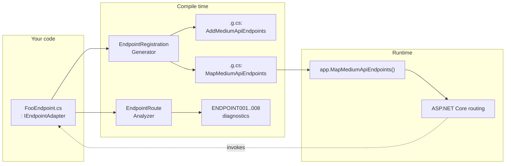
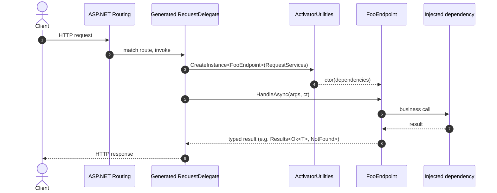

# RonSijm.MediumAPI

A class-based endpoint framework for ASP.NET Core Minimal APIs. Write one class per endpoint; a Roslyn source generator scans your compilation for `IEndpointAdapter` implementations and emits the `app.MapGet(...)`-style registration for you, while a companion analyzer checks that each route pattern and handler actually agree with each other at build time.

```csharp
internal sealed class HelloWorldEndpoint : IEndpointAdapter
{
    public HttpVerb Verb => HttpVerb.Get;

    [StringSyntax("Route")]
    public string Pattern => "hello";

    public Task<Ok<string>> HandleAsync(CancellationToken cancellationToken)
        => Task.FromResult(TypedResults.Ok("Hello, World!"));
}
```

```csharp
builder.Services.AddMediumApiEndpoints();
// ...
app.MapMediumApiEndpoints();
```

Implementing `IEndpointAdapter` *is* the registration: the generator finds the class at build time and wires it into routing for you, the same way it would if you'd hand-written the `MapGet` call yourself. There's no `services.AddScoped<HelloWorldEndpoint>()` to remember, and no separate line that can quietly go missing when a route stops working.

## Packages

| Package | Description |
|---|---|
| `RonSijm.MediumAPI` | Core interfaces (`IEndpointAdapter`, `HttpVerb`) - no ASP.NET Core dependency |
| `RonSijm.MediumAPI.Analyser` | Roslyn source generator (`AddMediumApiEndpoints` / `MapMediumApiEndpoints`) and diagnostic analyzer |

## Concepts

This document compares three different approaches to exposing an HTTP endpoint in ASP.NET Core:

- **Controllers** - the classic ASP.NET Core MVC model: `ControllerBase`, attribute routing, action filters, one class grouping several actions. Comfortable. Familiar. Also the reason your `PizzaController` has fourteen constructor dependencies and nobody remembers why.
- **Minimal API (vanilla)** - the `app.MapGet/Post/...(...)` lambda-based model introduced in .NET 6, used with no additional structure or conventions on top. Genuinely great, right up until you have more than about five routes and `Program.cs` starts looking like a phone book.
- **MediumAPI** - this library. It uses Minimal APIs as the underlying routing/execution model, and adds a small, source-generated adapter layer on top so each endpoint is expressed as one class instead of one inline lambda. Same engine, fewer ways to embarrass yourself.

MediumAPI is upfront that it's built on Minimal APIs - `HandleAsync` still returns `Results<Ok<T>, NotFound<...>>` and friends, and requests are still ultimately served by a `RequestDelegate`. It's genuinely a Minimal API wearing a slightly nicer shirt, not MVC wearing a trench coat. What it changes is how that delegate gets *authored and registered*, not what it fundamentally is.

## TL;DR comparison

If you who want the verdict before the argument:

| Feature / concern | Controllers | Minimal API (vanilla) | MediumAPI |
|---|---|---|---|
| **Single Responsibility** | ⚠️ Coarser-grained; one class groups multiple actions | ✅ One delegate per action | ✅ One class per action - finer-grained change boundary |
| **Open–Closed** | ⚠️ Existing controller grows as new actions are added | ⚠️ New lambdas added independently, but scattered | ✅ New action = new class; existing classes are never touched |
| **Cohesion / vertical slices** | ⚠️ Often grouped by resource noun, even with unrelated dependencies | ⚠️ Grouped by registration call site | ✅ Each endpoint is a self-contained, independently testable slice |
| **Boundary isolation** | ⚠️ Shared class scope makes accidental coupling between actions easy | ✅ Separate delegates; no shared class scope | ✅ Separate classes; accidental coupling requires an explicit dependency |
| **Framework abstraction** | ⚠️ Coupled to MVC concepts: `ControllerBase`, filters, attributes | ❌ Tightly coupled to the `IEndpointRouteBuilder` call site | ✅ Registration abstracted behind `IEndpointAdapter`; HTTP result types are still ASP.NET Core |
| **Endpoint registration** | ⚠️ Automatic via MVC `ApplicationParts` (reflection at startup) | ⚠️ Manual `app.MapGet(...)` call per endpoint | ✅ Source-generated at compile time; output inspectable in `obj/.../Generated` |
| **Route ⇄ handler mismatches** | ❌ Not caught by the compiler; surfaces at runtime | ❌ Not caught by the compiler; surfaces at runtime | ✅ Build error (`ENDPOINT001`–`ENDPOINT008`) |
| **Unit testing** | ⚠️ Needs `ControllerContext` / MVC pipeline for filters to run | ✅ Trivial - it's a delegate, call it directly | ✅ Trivial - plain class, `new` it and call `HandleAsync` |

If your instinct is to argue with a table, good news, there's a whole document below arguing with the table too.

## Why not just use Minimal APIs directly?

Minimal APIs are intentionally unopinionated. That's a feature for small APIs, and a liability for anything you'll still be maintaining in two years. At any non-trivial size, teams end up needing to answer the same questions themselves, usually in a Slack thread titled "endpoint conventions???":

- Where do we put the lambda? In `Program.cs`? In a partial class? In a static method?
- How do we make sure every route actually gets registered somewhere, and stays registered when the code is refactored?
- How do we test a lambda-based endpoint without spinning up `WebApplicationFactory` for what should be a two-line unit test?
- How do we keep `{id:int}` in the route pattern in sync with the `int id` parameter in the delegate as the code evolves, without finding out via a 404 in production?

Minimal APIs do have `.Produces<T>()`, `.WithOpenApi()`, typed results, and endpoint metadata, and this has improved significantly since .NET 6 - the issue was never that support is missing, it's that without team-wide conventions this metadata (and the registration calls themselves) become scattered and inconsistent as the number of routes grows. Freedom is great until forty developers each use it differently.

MediumAPI answers these with one convention: **an endpoint is a class implementing `IEndpointAdapter`.** Nothing else changes about how you write the handler body - the class still ultimately compiles down to the same `RequestDelegate` machinery ASP.NET Core uses for any other Minimal API. You're not buying a new engine, you're buying lane markings.

## Why not just use Controllers?

Controllers solve the "structure" problem, but at the cost of a coarser unit: a controller class groups *all* actions for a resource, whether or not they share dependencies, validation, or a reason to change. This is the part where the dogmatic among us start reaching for their well-worn copy of a 2009 blog post about MVC. Stay with me.

### Single Responsibility

There's a reasonable argument that a controller *can* be single-responsibility if it only handles routing for one resource. But "responsibility" here is not a true/false property, it's a spectrum, and the practical concern is **change boundaries**: a class-per-endpoint creates a smaller, more isolated unit - one route, one handler, one dependency set, one test surface. Adding a new action means adding a new class, which can be reviewed, tested, and versioned independently without touching any sibling action.

Lesser minds (you know who you are) might argue "a controller is also Single Responsibility, because 'bla bla bla'."

Ok, tell me this: who has more responsibilities - a mother with 1 child, or a mother with 7? You can claim that "being a mother" is a single responsibility, but that doesn't mean the two are equally responsible for the same amount of stuff. Single Responsibility is a spectrum, not a checkbox.

Minimal APIs and MediumAPI sit further along that spectrum toward "singular" than a controller does.

### Open–Closed Principle

A controller is rarely closed for modification in practice, no matter how confidently it was diagrammed on day one. It typically starts with the actions needed at the time (say, `Create` and `Delete`), and grows as new actions are needed (`Update`, `List`, and eventually `ExportToExcelForSomeReason`). Each addition means editing an existing, already-tested class - new constructor dependencies pile up, unrelated actions accumulate, and merge conflicts between feature branches become more likely over time. "Closed for modification" was a nice idea. The controller did not get the memo.

An endpoint class is made for a single action. Once it's implemented, the file can be left alone - new functionality goes into its own class instead, where it can't drag the old one down with it.

### Cohesion / vertical slices

A **vertical slice** organizes code by *feature* rather than by *technical layer* - everything needed to fulfill one request lives together. A controller often groups actions by resource noun even when those actions have different dependencies, different validation, and different reasons to change; that's a horizontal (layer-based) cut that works against feature isolation, dressed up to look like organization. Each `IEndpointAdapter` implementation is a single-action vertical slice: it has exactly the dependencies it needs and is independently testable without pulling in the concerns of sibling actions it has never met and shouldn't have to.

### Boundary isolation

In a controller, all actions for a resource share the same class. Nothing stops one action from calling another directly, bypassing whatever the HTTP boundary is supposed to enforce - because to the compiler, it's just a method call between old friends:

```csharp
public class BurgerController
{
    public Burger GetBurger(int id)
    {
        // Get implementation
    }

    public void Delete(int id)
    {
        var burger = this.GetBurger(id); // sibling call - no structural barrier stopping this
        burger.Delete();
    }
}
```

This is problematic because `GetBurger` is designed to be invoked by the ASP.NET routing infrastructure, not by sibling methods - calling it internally conflates the HTTP boundary with internal logic, and creates hidden coupling: a future change to `GetBurger` (e.g. adding caching or an audit log) can silently affect `Delete` as a side effect. Nobody put that in the design doc. Nobody ever does.

With MediumAPI, `GetBurgerEndpoint` and `DeleteBurgerEndpoint` are separate classes. Each depends only on what it needs; there is no shared class scope through which one endpoint could call the other. Calling another endpoint would require an explicit constructor dependency, which is immediately visible in code review - the structural separation doesn't make accidental coupling impossible (nothing stops determined bad decisions), but it does remove it as the path of least resistance.

### Framework abstraction

Using controllers ties your HTTP layer tightly to MVC concepts: `ControllerBase`, action filters, `[Authorize]`, `[ProducesResponseType]`, `ActionResult`, model binding. Swapping to a different endpoint model later is a significant rewrite because the framework surface is deeply embedded in the code - you didn't write a controller, MVC wrote most of it *through* you.

`IEndpointAdapter` abstracts the *registration mechanism*, not the entire HTTP framework - concrete endpoints still use ASP.NET Core result types (`Results<Ok<T>, NotFound<...>>`), so they're not fully framework-agnostic (that was never the goal, and anyone selling you "fully framework-agnostic" in the same breath as "runs on ASP.NET Core" is selling something else too). What it does buy: the registration mechanism - currently Minimal API source-generated routing - can be replaced without touching any concrete endpoint implementation.

### Testability

Testing a controller action in isolation typically requires setting up MVC infrastructure that has nothing to do with your own code:

```csharp
var controller = new PizzaController(mockManager.Object)
{
    ControllerContext = new ControllerContext { HttpContext = new DefaultHttpContext() }
};

var result = await controller.GetPizzaAsync(42, CancellationToken.None);
```

And even then, action filters do **not** run in a plain unit test - they only execute inside the full MVC pipeline, meaning the unit test doesn't faithfully represent runtime behavior. Testing filters requires a full integration test with `WebApplicationFactory`, at which point congratulations, your "unit" test takes longer to boot than the feature took to write.

An `IEndpointAdapter` is a plain class:

```csharp
var endpoint = new GetPizzaEndpoint(mockManager.Object);

var result = await endpoint.HandleAsync(pizzaId: 42, CancellationToken.None);

// result is Results<Ok<Pizza>, NotFound> - no HTTP infrastructure needed
result.Result.Should().BeOfType<Ok<Pizza>>();
```

Advantages:

- **No MVC infrastructure** - no `ControllerContext`, no `HttpContext`, no `WebApplicationFactory` for what is fundamentally `new X().DoThing()`.
- **Typed assertions** - the return type is a concrete discriminated result (`Results<...>`), not `IActionResult`. You assert on the exact type without inspecting status codes or response bodies like a haruspex reading entrails.
- **One endpoint per class** - no risk that test setup for one action inadvertently affects another action in the same class.

## Compile-time safety

The `RonSijm.MediumAPI.Analyser` package ships a Roslyn analyzer that catches route/handler mismatches as **build errors**, not runtime surprises reported by whoever happens to click the button first. With a controller or a vanilla Minimal API, a mismatch between a route template and a handler parameter (e.g. `Pattern => "pizzas/{pizzaId:int}"` next to `HandleAsync(int id, ...)`) fails silently at compile time and only surfaces as a runtime 400/404 on the first request that hits it - usually in front of a customer, never in front of the person who wrote it. With the analyzer active, the same class of mistake is a build error before the project can even run.

| Diagnostic | Severity | Catches |
|---|---|---|
| `ENDPOINT001` | Error | A `{param}` in `Pattern` has no matching `HandleAsync` parameter |
| `ENDPOINT002` | Error | A `HandleAsync` parameter has no matching `{param}` in `Pattern` |
| `ENDPOINT003` | Error | A route constraint (`{id:int}`) does not match the `HandleAsync` parameter type |
| `ENDPOINT004` | Warning | A route-registration lambda is not `static` - risks accidentally capturing startup state |
| `ENDPOINT005` | Warning | `Pattern` is missing `[StringSyntax("Route")]`, disabling IDE route tooling |
| `ENDPOINT007` | Error | An `IEndpointAdapter` implementation has no `HandleAsync` method |
| `ENDPOINT008` | Warning | An `IEndpointAdapter` has metadata the source generator cannot evaluate at compile time |

See `Examples/Diagnostics/` in this repository for a runnable project per diagnostic, each showing a violating case (suppressed via `<NoWarn>` so the demo project itself still builds cleanly, because even the cautionary tale has to compile) next to a valid case.

### Error detection lifecycle

When a bug is introduced, *when* it gets caught has a large impact on the cost of fixing it - the earlier in the lifecycle it's detected, the cheaper it is to resolve. This is not a controversial claim, and yet:

| Stage | Controllers / vanilla Minimal APIs | MediumAPI |
|---|---|---|
| Pre-compile (IDE, as you type) | ❌ No dedicated analyzer for route/handler mismatches | ✅ `ENDPOINT001`–`008` squiggles appear inline |
| Compile (`dotnet build`) | ❌ Route/param mismatches build fine | ✅ Build fails; cannot run |
| Local unit test | ⚠️ Possible, but controllers need MVC test setup | ✅ Plain class instantiation, no infrastructure needed |
| CI pipeline | ❌ Mismatches compile clean; nothing blocks the branch | ✅ Build fails; branch is blocked before a PR is even opened |
| Production / first real request | ❌ May reach here silently if no test happened to cover it | ✅ Already a build error; cannot reach this stage |

A routing bug in a controller or a vanilla Minimal API may survive all the way to a QA report or a production incident if no test happens to hit that exact endpoint. The same class of bug in a MediumAPI endpoint is a build error that never leaves the developer's machine.

It's worth naming directly: this isn't a claim that Minimal APIs are inherently better than controllers, or that this kind of analyzer could only ever be written for one or the other - an equivalent analyzer *could* be written for controller actions too. Nobody did, though, and "somebody could theoretically fix this" has never actually fixed anything. The point of MediumAPI is that pairing a small, uniform endpoint shape (`IEndpointAdapter`) with a purpose-built analyzer makes that verification cheap to build and apply consistently, in a way that ad-hoc lambdas or free-form controller actions don't naturally invite.

## How registration works



At compile time, `EndpointRegistrationGenerator` scans for `IEndpointAdapter` implementations in the compilation and emits, into the consumer's root namespace:

- `AddMediumApiEndpoints()` - a service-collection extension method.
- `MapMediumApiEndpoints()` - wires every discovered endpoint into `IEndpointRouteBuilder` using `RequestDelegateFactory` and `ActivatorUtilities`, the same machinery ASP.NET Core itself uses under the hood for ordinary Minimal APIs.

Discovery happens exactly once, at compile time: the generator inspects the compilation for `IEndpointAdapter` implementations and writes the registration code for each one it finds. That means the registration for a given endpoint lives in generated source next to the build output, not in someone's memory of a startup file — if a route stops working, the fix is "the class stopped compiling," not "someone quietly deleted a line two years ago." The generated source is a normal, inspectable file under `obj/.../Generated` - if you want to see exactly what gets executed for a given endpoint, you can open it and read it like any other generated code (e.g. EF Core migrations or `System.Text.Json` source-generated contexts), instead of trusting a `[ApiController]` attribute to have done the right thing somewhere in a framework assembly you'll never open.

### Request flow



The request flow has exactly one hop: ASP.NET Core routing matches the pattern and invokes the generated `RequestDelegate`, which constructs your endpoint via `ActivatorUtilities` and calls `HandleAsync` directly. A breakpoint in `HandleAsync` is reached the same way a breakpoint in a controller action or a Minimal API lambda would be. MediumAPI does not introduce a message bus, a mediator, or any other layer where a request "travels through the void" before reaching its handler; it only changes how the handler is discovered and wired up. If you were hoping to be smug about "just use MediatR instead," this isn't that, and you can put the pitchfork down.

## Component map

| Component | Role |
|---|---|
| `IEndpointAdapter` | Author-facing contract (`Verb`, `Pattern`, optional `AuthorizationPolicy`) |
| `HttpVerb` | Verb enum used by the generator |
| `EndpointRegistrationGenerator` | Source generator producing `AddMediumApiEndpoints` / `MapMediumApiEndpoints` |
| `EndpointRouteAnalyzer` | Diagnostic analyzer (`ENDPOINT001`–`ENDPOINT008`) |
| `EndpointDiagnosticIds` | Diagnostic ID constants |

## Tradeoffs

MediumAPI is not free, and anyone telling you a new abstraction has zero cost is either lying or hasn't shipped it yet. Choosing it over plain controllers or vanilla Minimal APIs means accepting the following costs:

- **A convention to learn.** Anyone touching the codebase needs to understand `IEndpointAdapter` and the generator before writing their first endpoint. Controllers and inline Minimal APIs are more widely documented and more familiar to newcomers - mostly because everyone has already been burned by them once, which counts as documentation.
- **A generator/analyzer dependency.** The source generator and analyzer are part of your build; keeping them working across new .NET/Roslyn SDK versions is an ongoing (if small) maintenance cost, and bugs in generated code can be harder to debug than bugs in hand-written registration calls. Generated code doesn't argue back, but it also doesn't apologize.
- **Still an ASP.NET Core Minimal API under the hood.** `HandleAsync` still returns ASP.NET Core result types. This is a registration-and-structure abstraction, not a full HTTP-framework abstraction - swapping the entire hosting model would still touch every endpoint. If you were hoping this finally frees you from ASP.NET Core itself, it doesn't, nothing reasonably does, and be suspicious of anything that claims otherwise.
- **More files for simple CRUD.** One class per action is more files than one controller with several actions, or one file full of lambdas. For a handful of trivial routes, this can feel like more ceremony than it's worth. If your entire API is three routes, you may not need any of this, and that's fine - not every hill needs a flag planted on it.

The tradeoff pays off once you have enough endpoints that "does this route actually match its handler" stops being something you can eyeball - at that point, compile-time verification is worth the extra file per route, and "I'll just be careful" stops being a strategy.

## Usage

1. Reference `RonSijm.MediumAPI` and add `RonSijm.MediumAPI.Analyser` as an analyzer (`OutputItemType="Analyzer"`, `ReferenceOutputAssembly="false"`).
2. Implement `IEndpointAdapter` for each endpoint.
3. Call `builder.Services.AddMediumApiEndpoints()` and `app.MapMediumApiEndpoints()` during app setup.

See `Examples/RonSijm.MediumAPI.Example` for a complete minimal host with an integration test, and `Examples/Diagnostics/` for one project per analyzer diagnostic - for when reading about a mistake is less convincing than watching the build fail because of it.
